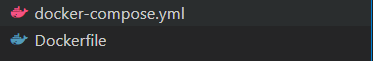
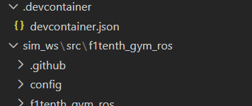
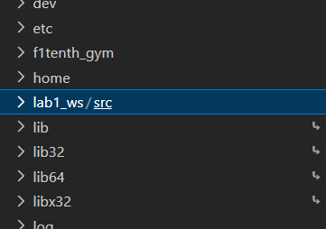

# UNLV F1Tenth VSCode Integration

This guide will show you how to integrate VSCode within your Docker project. Doing this is completely **optional** for the course.

Doing this will provide you useful tools for your project:

* VSCode Editor - Graphical editor
* VSCode Extensions (linters, type checkers) - Very useful!

## 1: Initial Setup

This guide takes place after you do steps 1-3 in [Lab 1](https://github.com/unlv-f1/lab1). Note that this sets up a new Docker container separate from the one ran from `f1tenth_gym_ros`. Make sure to shut down your original container if it isn't already down.

First, install [Visual Studio Code](https://code.visualstudio.com/) if you haven't already.

Then, install the [Dev Containers VSCode Extension](https://marketplace.visualstudio.com/items?itemName=ms-vscode-remote.remote-containers) for VSCode.

Afterward, in VSCode, open the folder containing all of your ROS 2 workspaces (e.g. `sim_ws/`, `lab1_ws/`).

Then, copy and paste the *docker-compose.yml* and *Dockerfile* from the *f1tenth_gym_ros folder* into the folder root.



Then, in your **new** *docker-compose.yml* file, under `services.sim.volumes`, change this line

```
      - .:/sim_ws/src/f1tenth_gym_ros
```

to

```
      - ./sim_ws/src/f1tenth_gym_ros:/sim_ws/src/f1tenth_gym_ros
```

We need to do this because the relative paths have changed.

Then, from the folder root (not a workspace root), create a new file called `.devcontainer/devcontainer.json`.



Then copy and paste the following contents inside:

```json
{
  // Name of container
  "name": "Ubuntu ROS2 Foxy F1Tenth",
  // Docker Compose file to use
  "dockerComposeFile": "../docker-compose.yml",
  // Service to work on (one of the services in the compose file)
  "service": "sim",
  // Path of the workspace folder inside the container
  "workspaceFolder": "/",
  "customizations": {
    "vscode": {
      // VSCode Extensions to install in the environment
      "extensions": [
        "ms-python.python",
        "ms-python.vscode-pylance",
        "ms-python.debugpy",
        "ms-azuretools.vscode-docker",
        "charliermarsh.ruff",
        "ms-python.black-formatter"
      ],
      // Settings
      "settings": {
        "[python]": {
          "editor.defaultFormatter": "charliermarsh.ruff",
          "editor.formatOnSave": true
        },
        "python.analysis.include": [
          "/lab?_ws/src/**/*",
          "/sim_ws/src/**/*"
        ]
      }
    }
  }
}
```

This is a configuration file for the Dev Container, you can change some of the settings if you want to alter some of the settings. For more information, see the [VSCode Dev Containers documentation](https://code.visualstudio.com/docs/devcontainers/containers).

Once you have finished copy and pasting, go to the Command Palette (use `Ctrl+Shift+P` or **Run > Command Palette**). Then, type in and enter **Dev Containers: Rebuild and Reopen in Container**. This will build the docker container and make your VSCode window open *inside* the container.

And you are all set up!

To exit the container, go to the Command Palette again, then type in and enter **Dev Containers: Reopen Folder Locally**. This will make your VSCode window switch back to your local folder. (Since no more windows have the container open, the container will also shut down as well.)

## Interlude: Commands

Here are some useful VSCode commands you can use. (You don't need to run these.)

Some useful commands to know *outside* the container:

* **Dev Containers: Rebuild and Reopen in Container**: Builds and opens in container.
* **Dev Containers: Reopen in Container**: Opens in container without rebuilding.
* **Dev Containers: Rebuild Without Cache and Reopen in Container**: Completely rebuild and reopen in container.

A useful command to use *inside* the container:

* **Dev Containers: Reopen Folder Locally**: Opens outside the container (locally).

## 2: Adding a New Volume Mount

The next step is to add a new volume mount, so that you can sync directories between your local environment and your container environment.

Ensure that you are in your local folder, not your container folder. To add a new volume mount, go to your *docker-compose.yml* (in your root) and add a new line under `services.sim.volumes` with the following syntax:

```
      - <path-locally>:<path-in-container>
```

For example, if you wanted to mount a folder `./lab1_ws/src`, you would add the line:

```
      - ./lab1_ws/src:/lab1_ws/src
```

Then, rebuild and reopen your container, and verify that `./lab1_ws/src` is mounted. You should see something like this:



You'll need to add a new mount for every lab for this semester.

## 3: Adding a .bashrc file

Finally, we will mount a modified *.bashrc* file. This file is ran every time a new terminal is created inside your container. It is also used by the Python extension, so if you don't source the underlay in this file, it will not know where the installed Python packages are for ROS 2.

First, copy and paste the *.bashrc* file (located within this Github repo) into your root folder. This file is the default *.bashrc* file but with an additional line at the bottom:

```bash
source /opt/ros/foxy/setup.bash
```

Then add the following volume mount by putting the following line under your `services.sim_volumes` in your *docker-compose.yml* file (in your root):

```
      - ./.bashrc:/root/.bashrc
```

Afterward, enter your container again. You should see it under */root*.


## 4: Sourcing Overlays in .bashrc (Optional)

In the previous step, we mounted a *.bashrc* file which at the end of it, automatically sources the underlay using:

```bash
source /opt/ros/foxy/setup.bash
```

Thus, you no longer need to use this line when you're starting a new shell. Optionally, you can add additional lines to source the overlays of each of your different workspaces. If you have two workspace folders */sim_ws/* and */lab1_ws/*, then you would add the following two lines to the end of *.bashrc*:

```bash
source /sim_ws/install/local_setup.bash
source /lab1_ws/install/local_setup.bash
```

NOTE: If you've never built a certain workspace yet, then a new terminal will output an error (but not crash) upon startup, since the *install/local_setup.bash* file wouldn't exist for that workspace.

NOTE: No two nodes across all of your workspaces **should not** share the same names.

## Return to Lab 1

After you follow these instructions, you should return to Step 5 in the lab, skipping Step 4 (this step is already covered by the volume mounts section).

Note that you'll no longer need to use the `docker` commands manually anymore, since these are covered by the VSCode commands found in the Command Palette.

Here is a [link to Lab 1](https://github.com/unlv-f1/lab1).

## Resources

Here is a resource you can look at for VSCode Dev Containers:

* VSCode Dev Containers:  https://code.visualstudio.com/docs/devcontainers/containers
